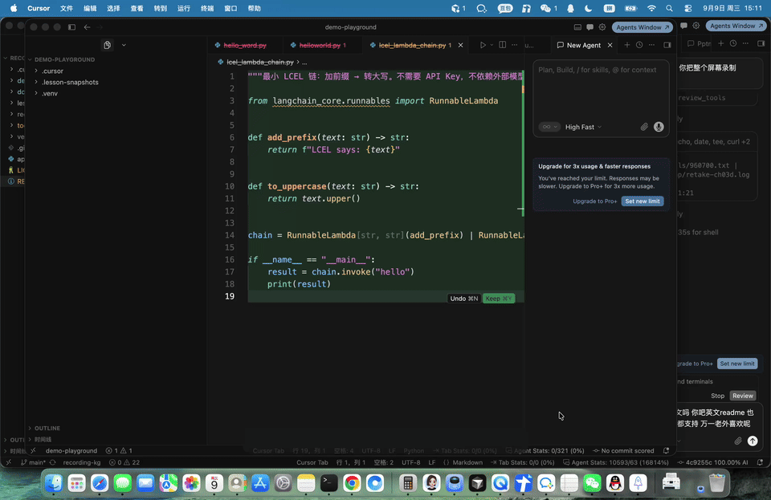
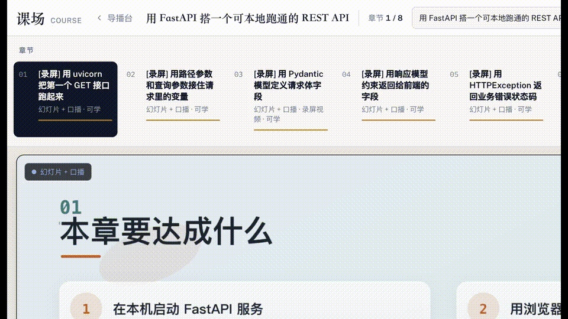

# recording-kg · 课场

**语言：** [English](./README.md) · [中文](./README.zh-CN.md)

> **Status: Early Preview（早期预览）**  
> API、目录约定和学生端 UI 仍可能变化；适合试用与反馈，不保证生产稳定。  
> 欢迎 Issue / Discussion。

本地可跑的 **录课导播台 + 时间轴学生端**（源码公开；**非商用免费，商用需授权**）。  
面向编程教学：PPT 口播、Cursor 实操录屏、学生端按 `timeline.json` 播放，答疑时主舞台接管讲解。

仓库：https://github.com/wincap/recording-kg

> **公开范围**：代码与文档。  
> **不公开**：API Key、本地 `recordings/` 成片、学员笔记与上传素材（默认已在 `.gitignore`）。  
> **商用**：代录、私有部署、二次销售等请先开 [Issue](https://github.com/wincap/recording-kg/issues) 申请授权。

---

## 演示

| 步骤 | 画面 |
|------|------|
| 1 | 学生端播放「幻灯片 + 口播」 |
| 2 | 第 3 章时间轴：PPT → 衔接 → 实操 → 对照 |
| 3 | 切到 Cursor **录屏视频** |
| 4 | **答疑主舞台**：学生代码 / AI 讲义左右分栏 |

**整屏实操录屏（第 3 章 Cursor，约 32 秒）：**



视频文件：[docs/demo-cursor.mp4](docs/demo-cursor.mp4)

**学生端真实窗口录屏（第 3 章：PPT → 衔接 → 实操 → 对照，约 40 秒）：**



视频文件：[docs/demo-watch.mp4](docs/demo-watch.mp4)

本地复现：

1. `python3 tools/record-lesson/studio_server.py`
2. 打开 http://127.0.0.1:8765/watch
3. 选 FastAPI REST 课 → 第 3 章 → 点「实操」；上传代码可进答疑舞台

---

## 解决什么问题

| 痛点 | 常见做法 | 本项目 |
|------|----------|--------|
| 改一页 PPT 就要整集重压片 | 合成一条长 `lesson.mp4` | **素材解耦**：幻灯片 + 口播 + 录屏分文件，时间轴驱动 |
| 答疑挤在侧边小聊天框 | 主画面还是原视频 | **答疑上主舞台**：学生代码/截图与 AI 讲义左右分栏 |
| 口播与画面绑死 | 改词等于重录成片 | 换 `*.m4a` / `slides/` 即可，不用重拼视频 |
| Key / 成片误传仓库 | `.env`、大视频进 Git | `.env`、`recordings/` 默认忽略 |

---

## 核心能力

1. **导播台（录课）** — 课纲、出 PPT/口播、录 Cursor、写 `timeline.json`
2. **学生端「课场」（看课）** — 读时间轴，按时间切换幻灯片 / 录屏 / 口播
3. **语音 / 上传答疑** — 素材落盘，DeepSeek 生成讲义，主画布进入答疑模式后可一键回课
4. **学习记录** — `student-notes.json` + `student-assets/`（本地，不进 Git）

---

## 仓库结构（精简）

```text
recording-kg/
├── tools/record-lesson/     # 导播台 + 学生端（主入口）
│   ├── studio_server.py     # http://127.0.0.1:8765
│   ├── web/index.html       # 导播台
│   ├── web/watch.html       # 学生端「课场」
│   ├── course.py / voiceover.py / student_coach.py
│   └── ...
├── tools/ppt-studio/        # PPT / DeepSeek 画页
│   └── .env.example         # 只提交示例，真正的 Key 放本地 .env
├── recordings/              # 成片与课程素材（Git 忽略）
├── README.md                # English
└── README.zh-CN.md          # 中文
```

---

## 安全：Key 怎么藏

**已做：**

- `.gitignore` 忽略：`.env`、`**/.env`、`recordings/`、`student-notes.json`、`student-assets/`、`.venv` 等
- 仓库里只有 `.env.example`（空值模板），**没有真实 Key**

**你需要做：**

1. 本地配置（勿提交）：

```bash
cp tools/ppt-studio/.env.example tools/ppt-studio/.env
# 编辑 .env，填入 DEEPSEEK_API_KEY=sk-...
```

2. 推送前自查：

```bash
git status
git grep -n 'sk-' -- ':!**/.env.example'   # 应无真实 key
```

3. 若 Key 曾出现在聊天/截图里，到 [DeepSeek 控制台](https://platform.deepseek.com/) **轮换作废旧 Key**，再写入本地 `.env`。

---

## 环境要求

- macOS（录屏 / 窗口控制依赖本机能力）
- Python 3.10+
- ffmpeg（口播时长探测、抽音频等）
- 可选：`tesseract`（学生截图 OCR）
- 可选：Edge TTS / 系统 `say`（口播）

---

## 部署 / 本地启动

### 1. 克隆

```bash
git clone https://github.com/wincap/recording-kg.git
cd recording-kg
```

### 2. Python 依赖

```bash
cd tools/record-lesson
python3 -m venv .venv
source .venv/bin/activate
# 按你本机已有依赖安装；至少保证能 import 项目内模块
# 若有 requirements.txt 再：pip install -r requirements.txt
```

### 3. 配置 DeepSeek（答疑 / 画页）

```bash
cp ../ppt-studio/.env.example ../ppt-studio/.env
# 写入 DEEPSEEK_API_KEY
```

### 4. 启动导播台 + 学生端

```bash
cd tools/record-lesson
python3 studio_server.py
```

浏览器打开：

| 页面 | 地址 |
|------|------|
| 导播台（录课） | http://127.0.0.1:8765/ |
| 学生端（看课） | http://127.0.0.1:8765/watch |

成片与时间轴在本地目录：`recordings/courses/<课名>/ch-XX/`。  
克隆空仓库后若没有 `recordings/`，需自己在导播台出片，或从备份拷贝（不要把含 Key 的 `.env` 一起拷进 Git）。

### 5. 冒烟检查

```bash
curl -sS http://127.0.0.1:8765/api/courses
curl -sS -o /dev/null -w '%{http_code}\n' http://127.0.0.1:8765/watch
```

### 6. 测试（可选）

```bash
cd tools/record-lesson
source .venv/bin/activate   # 若已建 venv
python -m unittest test_lesson_tools.py -v
```

---

## 看课时间轴约定

章节目录下的 `timeline.json` 示例：

```json
{
  "kind": "play",
  "clips": [
    {
      "id": "intro",
      "kind": "slides",
      "title": "PPT",
      "audio": "intro.m4a",
      "dur": 71.0,
      "pages": [{ "src": "slides/01.png", "at": 0, "dur": 14 }]
    },
    {
      "id": "cursor",
      "kind": "video",
      "title": "实操",
      "src": "cursor.mp4",
      "dur": 33.0
    }
  ]
}
```

- `slides`：幻灯片 + 口播音频  
- `video`：录屏  
- `audio`：纯口播  

学生端按全局时间推进，答疑时使用**独立答疑进度条**，正课进度条暂停。

---

## 优点一览

- **可维护**：改页、改词、改录屏互不影响  
- **可教学**：PPT 概念 → 动手衔接 → Cursor 实操 → 对照  
- **可互动**：上传代码/截图自动进入答疑主舞台  
- **可私有部署**：本机 HTTP 服务，数据在本地  
- **安全默认**：密钥与成片不进仓库  

---

## 已知边界（Early Preview）

- 当前为早期预览：接口与 UI 可能出现不兼容变更  
- 录屏相关能力以 **macOS** 为主  
- 答疑模型当前走 **DeepSeek**（需自备 API Key）  
- 截图 OCR 依赖本机 `tesseract`；未安装时仍可答疑，但看图能力弱  
- `recordings/` 体积大，用网盘/对象存储备份，不要进 Git  

---

## 许可证

[PolyForm Noncommercial 1.0.0](./LICENSE) — **个人学习、研究、非营利用途可免费使用与修改**；**任何商用（含收费服务、闭源产品、商业培训等）须单独授权**。  
再次提醒：不要把 `.env`、成片或学员隐私提交进公开仓库。
